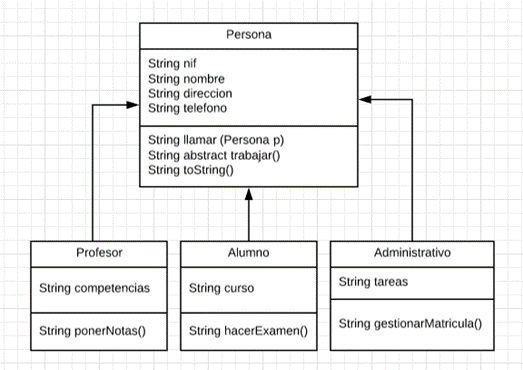
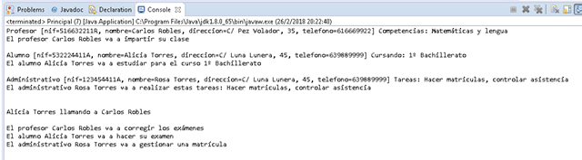

"ACTIVIDAD 6" 
Para la gestión de un centro educativo, un programa necesita contemplar las entidades profesor, alumno y administrativo, teniendo en cuenta que todos, a su vez, son personas.

    Crea la estructura de clases que se corresponda con el siguiente diagrama:

    La clase Persona será abstracta.
    Todas las propiedades serán privadas y accesibles mediante métodos get/set.
    El método llamar() devolverá una cadena similar a esta: “Alicia Torres llamando a Carlos Robles”. Como parte de la cadena se utilizará la propiedad nombre del objeto al que se aplica y del objeto pasado como argumento.
    El método trabajar() se especializará en cada subclase para devolver una cadena que indique el tipo de tarea que realiza cada perfil de persona. Por ejemplo:
        Profesor: “El profesor Carlos Robles va a impartir su clase”. Como parte de la cadena usarás la propiedad nombre.
        Alumno: “El alumno Alicia Torres va a estudiar para el curso 1º Bachillerato”. Como parte de la cadena usarás las propiedades nombre y curso.
        Administrativo: “El administrativo Rosa Torres va a realizar estas tareas: hacer matrículas, controlar asistencia”. Como parte de la cadena utilizarás las propiedades nombre y tareas.
    Además, las clases derivadas ampliarán su especialización con métodos propios como ponerNotas(), hacerExamen() o gestionarMatricula(). Cada uno de estos métodos devolverá una cadena de este tipo:
        ponerNotas(): “El profesor Carlos Robles va a corregir los exámenes”. Como parte de la cadena tienes que utilizar la propiedad nombre.
        hacerExamen(): “El alumno Alicia Torres va a hacer su examen”. Como parte de la cadena debes utilizar la propiedad nombre.
        gestionarMatricula(): “El administrativo Rosa Torres va a gestionar una matrícula”. Como parte de la cadena utilizarás la propiedad nombre.
    Además de lo especificado en el diagrama de clases, debes sobrescribir el método toString() en cada una de las clases para que muestre toda la información posible. Puedes hacerlo de forma automática con ayuda de Eclipse (clic derecho / Source / Generate toString…).

 

    Para terminar crea la clase Principal con método main y realiza las siguientes acciones:

 

    Crea un objeto Profesor, un objeto Alumno y un objeto Administrativo.
    Ejecuta el método toString() sobre cada uno de ellos.
    Ejecuta el método trabajar() sobre cada uno de ellos.
    Ejecuta el método llamar(Persona p) para que el alumno llame al profesor.
    Ejecuta el método ponerNotas() del objeto Profesor.
    Ejecuta el método hacerExamen() del objeto Alumno.
    Ejecuta el método gestionarMatricula() del objeto Administrativo.

 

Ejemplo de ejecución:

